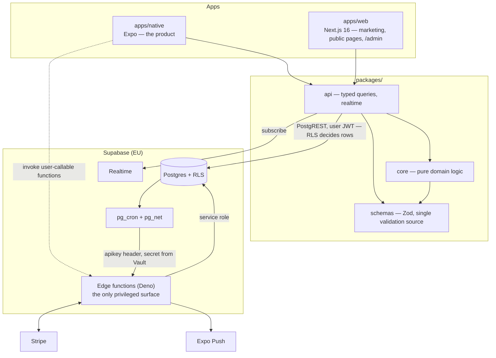

# Athanor — Architecture

**Status:** living document · describes the `dev` branch
**Reader:** you, a developer new to this repo. `README.md` tells you the rules and how to get running; this document tells you the shape of the system and the places where it behaves differently from what you would guess.
**Companion docs:** `docs/PRD.md` (what and why, by §) · `docs/DESIGN.md` (how it looks, by §) · `docs/RELEASE-RUNBOOK.md` (release ops) · `docs/PRODUCTION-READINESS.md` (what is parked, and P8's document map)

---

## 1. What Athanor is

Athanor is a mobile community platform built on one claim: your standing in the community reflects what you actually did for other people. That standing is a number called **Aura**, and the only way to raise it is real, verifiable action — helping someone reach a milestone, showing up at an event, being vouched for. Paying for anything in the app earns exactly zero. That is not a policy statement: it is enforced by row-level security in the database and asserted by tests, and a test in `packages/core` fails if Circle membership or a fund contribution ever grants a point.

The product is Italian-first (English fully supported) and speaks like a wise friend, never like a corporation — «Hai un Momento», never «Hai una nuova notifica». Two words are banned from user-facing copy: «engagement» and «utenti»; say persone, momenti, progetti.

What a member actually does, in one pass:

- **Il Sogno** — declare one active personal goal, broken into concrete _tappe_ (milestones). Others see it and offer real help on any step; a pay-it-forward mechanic lets someone you helped pass the favour on.
- **Momenti** — a small curated deck of one-to-one introductions, at most three a day. Mutual interest becomes a match and a private chat. Scarcity is the quality mechanism.
- **Athanor Live** — real gatherings. RSVP free or buy a ticket through hosted Stripe Checkout, then check in at the door with a signed QR code.
- **Community** — posts, comments, media, ephemeral stories. Reaction counts are visible to the author only; there is no public like-counter anywhere.
- **Il Cuore** — the community fund. Members contribute from €1, candidate their dream, vote (one member, one vote), and the money is released against verified plan phases. Contributing earns zero Aura.
- **Circle** — an optional paid membership unlocking conveniences (advanced search, premium events). Deliberately has zero effect on Aura — that is the whole point of it existing.
- **Trust & control** — blocking, reporting, Stripe Identity verification (required to sell tickets or candidate a dream), notification preferences, GDPR export and deletion.

## 2. The vocabulary

These are product nouns, not translations. They appear in table names, i18n keys, issue titles and conversation — learning them is most of learning the codebase.

| Term                            | Meaning                                                                                                                                                                             |
| ------------------------------- | ----------------------------------------------------------------------------------------------------------------------------------------------------------------------------------- |
| **Athanor**                     | The alchemical furnace — the vessel where slow transformation happens. Tagline: «Trasforma il tempo in valore.»                                                                     |
| **la Mandorla**                 | The vesica piscis — the almond formed where two circles overlap, each passing through the other's centre. The logo mark; the burst used for a match and a tier-up. Never a UI fill. |
| **✦ / l'istante**               | The single reaction («light a star»), the moment mark at the logo's apex, and the Momenti tab badge. Never rendered as a count.                                                     |
| **Aura**                        | The 0–1000 earned score. Also the cyan `#2BD0D2`, the one accent colour, reserved for action and meaning.                                                                           |
| **Tier**                        | Scintilla · Bagliore · Luce · Faro · Costellazione. Presentation only; a tier grants nothing.                                                                                       |
| **Le Sei Stelle**               | The six earned badges. A star is _accesa_ (lit) or _spenta_ — never "unlocked".                                                                                                     |
| **Il Sogno · tappe**            | The member's dream in their own words, and its concrete milestones: «un logo», «un mentor», «il primo cliente».                                                                     |
| **Momento · Momenti**           | A curated introduction to another member. «Hai un Momento.»                                                                                                                         |
| **Costellazioni**               | Collaboration — the project board, «dove le connessioni diventano lavoro concreto». Also the network metaphor: «porta una stella nella tua costellazione».                          |
| **Passa il Favore**             | Pay it forward — offering or asking for concrete, non-monetary help.                                                                                                                |
| **Il Fondo dei Sogni**          | The pooled community fund realising one member's dream per cycle. Screen title: «Dai Vita al Tuo Sogno».                                                                            |
| **Ciclo**                       | A fund cycle — candidacy, screening, voting, announcement, realization, closed. Not a calendar year.                                                                                |
| **Athanor Live · Athanor Days** | The events pillar, and the platform-official gatherings within it (Circle members get early access).                                                                                |
| **Athanor Circle**              | The paid membership — «un cerchio interno di appartenenza». Sells tools, never position.                                                                                            |
| **Prime Stelle**                | The founding cohort. A cosmetic badge that never touches the score.                                                                                                                 |
| **Passo · passi**               | A "step" — the register used for posting: «Condividi un passo del tuo percorso».                                                                                                    |
| **Evoluzione**                  | The feed category reserved for narrating your dream. It feeds the Visionario and Innovatore stars.                                                                                  |

## 3. Feature map

Every row exists end to end — screen, data access, table, policy. Routes live under `apps/native/src/app/`: tabs in `(tabs)/`, everything else in `(modal)/`.

| Feature                  | Mobile surface                                                                                                           | Backend                                                                                                                                                                 |
| ------------------------ | ------------------------------------------------------------------------------------------------------------------------ | ----------------------------------------------------------------------------------------------------------------------------------------------------------------------- |
| Onboarding (PRD §4.1)    | `(onboarding)` — three questions before the account exists; answers flush to the profile after auth                      | Supabase Auth, PKCE. Email+password and Google live; Apple written but gated until the Developer account exists                                                         |
| Profilo Evolutivo (§4.2) | `(tabs)/profile`, `user/[id]`, `grid`, the `@handle` catcher                                                             | `profiles` with per-field visibility enforced in Postgres — a hidden field never leaves the database. Public SSR twin at `/@handle` on the web                          |
| Il Sogno + tappe (§4.3)  | `dream-editor`, `milestone`, `help`                                                                                      | `dreams · dream_milestones · milestone_helps`. The `contribution` help type is deliberately absent — money between members is out of scope and the UI says so           |
| Home (§4.4)              | `(tabs)/index` — greeting, fund countdown hero, recap, stars, suggested Momenti, invite CTA                              | Composes other domains; owns the explicit «no active cycle» state — the fund counter never renders a bare €0                                                            |
| Community (§4.5)         | `(tabs)/community`, `post-compose`, `story-compose`, `stories`, `post/[id]`                                              | Posts, comments, media, reactions, stories; realtime feed; ranking is chronological within a tab; counts are author-only                                                |
| Athanor Live (§4.6)      | `live`, `event-create`, `event-filters`, `event/[id]`, `checkin`, `ticket/[id]`, `my-events`                             | `events · rsvps · event_tickets · event_attendance`; `create-ticket-checkout` and `check-in` functions; minute-level live and reminder sweeps on cron                   |
| Momenti (§4.7)           | `(tabs)/momenti` swipe deck, `match` overlay                                                                             | `momento_proposals · momento_suggestions`, filled nightly by a deterministic SQL matcher (profession complementarity, shared tags, proximity, dream-keyword overlap)    |
| Messaging (§4.8)         | `messages`, `chat`, `new-message`, `blocked`                                                                             | `conversations · messages` over Realtime, cursor-paginated. Group chat, read receipts and typing indicators are deliberately not built                                  |
| Aura (§4.9)              | `aura`, `aura/ledger`, `star`, `level`, `recap`                                                                          | `aura_events` (append-only ledger) → nightly recompute with decay → `aura_scores`, plus `stars`. Written by `score-engine` alone — see §4                               |
| Il Fondo (§4.11)         | `annual`, `fund-disclosure`, `candidacy` wizard, `plan`, `progress`                                                      | Fund tables plus six privileged functions carry the cycle. One member one vote; a cycle must clear published turnout and funding floors or it voids and carries forward |
| Circle (§4.12)           | `circle` (its subscribe/manage CTAs are replaced by a note on iOS — Apple 3.1.1), `payments`, `search`, `search-filters` | `circle_memberships` as a cache of Stripe Billing; checkout and portal functions; an entitlement hook gates the features                                                |
| Trust & safety (§4.13)   | `verify`, `trust`, `report`, `blocked`                                                                                   | `reports · blocks · verifications`; `moderation-enforce` applies the ban when a report resolves that way. The block predicate sits inside the SELECT policies           |
| Notifications (§4.14)    | `notifications`, `notif-prefs`                                                                                           | Domain event → `notification-fan-out` (sole writer) → `push-dispatch` → Expo. An outbox reconciler and producer sweeps run every minute                                 |
| Costellazioni (§4.15)    | `(tabs)/costellazioni`, `project-compose`, `listing/[id]`, `favor`, `connections`                                        | `projects · favor_offers · connections · connection_requests` — the first-degree graph a future feed boost will consume                                                 |
| GDPR                     | `data-export`, `delete-account`                                                                                          | `consent` + job tables; nightly export signs a 72-hour URL; erasure revokes sessions, deletes content, pseudonymises legally-retained money rows                        |
| Public web               | —                                                                                                                        | Marketing landing, `/@handle` profiles, dream/event permalinks, invite landing, waitlist. Posts are members-only by ruling — no public per-post page exists             |
| Moderation panel         | — (web `/admin`, maintained by partner devs)                                                                             | Role-checked server-side access; report queue, verdicts, audit trail, fund admin; headless API in `packages/api/src/admin.ts`                                           |
| Boot & remote config     | Force-Update / Maintenance screens                                                                                       | `remote_config` read at boot; pure decision in `core`; HTTP 426 server backstop — see §11                                                                               |

## 4. The Aura engine

The scoring rules live as named, test-asserted constants in **one module — `packages/core/src/score/weights.ts`** (README rule 10). That module is the single source of truth and the values are server-tunable; the tables below show the constants as they stand and will drift only if that module changes, which is exactly the edit that would update this section.

**What earns points:**

| Action                                         | Points     | Cap            |
| ---------------------------------------------- | ---------- | -------------- |
| Identity verified                              | +50        | once, lifetime |
| Helped someone's milestone (owner-confirmed)   | +40        | uncapped       |
| Organised an event (≥5 attendees)              | +30        | 2 / month      |
| Attended an event (checked in)                 | +15        | 4 / week       |
| Completed own milestone                        | +10        | uncapped       |
| Momento conversation (≥10 messages both sides) | +5         | 10 / month     |
| Post received a ✦                              | +3         | 10 / day       |
| Report upheld against you                      | −50 … −200 | —              |
| Circle membership · fund contribution          | **0**      | by rule        |

A ✦ counts only when the reactor's own Aura is above 300, weighted by `min(2, 1 + ln1p(score/1000))`. The engine deliberately never rewards _creating_ content — only reactions earned. Reward volume and you get volume.

**Decay.** Inactive more than 30 days → ×0.98 per elapsed week, floored at 40% of lifetime peak, applied by the nightly cron. The score is a picture of what you are doing, not a trophy shelf.

**Tiers** (presentation only, nothing granted): scintilla 0 · bagliore 250 · luce 500 · faro 750 · costellazione 1000. Crossing one triggers a small celebration; there are no leaderboards.

**The six stars** — earned by the engine, never chosen:

| Star          | Criteria                                                        |
| ------------- | --------------------------------------------------------------- |
| Visionario    | dream published · 3 tappe defined · 10 starred Evoluzione posts |
| Creatore      | 2 own tappe completed                                           |
| Mentor        | 3 helps completed for others                                    |
| Innovatore    | 5 starred posts from 10 distinct members                        |
| Collaboratore | 5 Momento conversations                                         |
| Ambasciatore  | 5 invites activated                                             |

Own profile shows progress toward all six; other people see only the earned ones — enforced by RLS, not by the client.

## 5. The system in one picture

Two apps sit on a set of shared packages. Everything talks to one hosted Supabase project (Postgres with row-level security, Auth, Realtime, Storage) plus a set of Deno edge functions — and the edge functions are the **only** privileged surface in the system. There is deliberately no middle API tier.

The dependency rule is strict and one-way: **apps → packages**, and inside packages `core` imports only `schemas`. `api` is plumbing with no business logic; `core` is business logic with no I/O. `i18n` and `config` (design tokens) are consumed by both apps.

## 6. How data moves

**Reads.** Screen → TanStack Query hook → an `@athanor/api` domain function → Zod parse → PostgREST with the user's JWT. **RLS decides which rows exist** — there is no server-side filtering layer to forget. Pagination is cursor-based everywhere (README rule 9); an `offset` is a bug even when it works, because it skips rows under concurrent inserts.

**Realtime.** Subscriber helpers in `@athanor/api` listen on `postgres_changes` and **invalidate query keys** rather than writing caches directly. Every subscriber returns its cleanup function, and callers unsubscribe on unmount — a subscription that outlives its screen leaks a channel.

**Privileged writes.** A client can never perform these; each has exactly one writer:

| Domain          | Sole writer                                                                                                                                                                      |
| --------------- | -------------------------------------------------------------------------------------------------------------------------------------------------------------------------------- |
| Aura (score)    | `score-engine` — RLS denies all client writes; pgTAP asserts it                                                                                                                  |
| Money tables    | `stripe-webhook` — signature-verified, deduped (one carve-out: `create-payout-onboarding` inserts the initial `payout_accounts` pointer row; the webhook owns the state columns) |
| Notifications   | `notification-fan-out` → rows → `push-dispatch` → Expo push                                                                                                                      |
| Fund lifecycle  | `screen-candidacy` · `declare-winner` · `announce-cycle` · `close-cycle` · `verify-plan-phase` · `release-fund-payout`                                                           |
| Moderation bans | `moderation-enforce` (applies the auth-level ban)                                                                                                                                |
| Media hygiene   | `media-process` (strips EXIF/metadata on upload)                                                                                                                                 |

## 7. The edge-function contract

Every function declares exactly **one of three auth postures** in `supabase/config.toml`, and `_shared/config-invariants.test.ts` asserts the whole table — a new function cannot land with the wrong posture.

| Posture               | Gate                                                                                                                                                                                                                                                    |
| --------------------- | ------------------------------------------------------------------------------------------------------------------------------------------------------------------------------------------------------------------------------------------------------- |
| User-callable         | `verify_jwt = true` **and** `requireUser(req)` as the first statement. Two gates — the platform gate only proves a JWT is well-formed.                                                                                                                  |
| Internal service-role | `verify_jwt = false`, because an `sb_secret_…` key is not a JWT and the platform gate could only reject it. `requireServiceRole(req)` is therefore the **only** gate and must be the first statement — anything before it is reachable unauthenticated. |
| Webhook               | `verify_jwt = false`; authenticity is the Stripe signature plus dedupe on `stripe_webhook_events.event_id`.                                                                                                                                             |

Two conventions that look optional and are not:

- **API keys resolve only through `_shared/keys.ts`.** The platform injects `SUPABASE_PUBLISHABLE_KEYS` / `SUPABASE_SECRET_KEYS` as _name-keyed JSON_, not plain strings — a direct `Deno.env.get` returns something that only looks wrong at runtime.
- **`profile_id` always comes from `getUser()`, never from the request body.**

## 8. Database rules that bite

- **Migrations are append-only once applied.** Never edit one — write a new one (`supabase migration new <name>`). A wrong _comment_ in an applied migration can't be fixed either: corrections live in `supabase/MIGRATIONS-ERRATA.md`, and the pgTAP test is the source of truth. **Read the errata before trusting a migration's prose.**
- **A new table is unreachable by clients until its migration grants explicitly.** Default privileges were deliberately narrowed; the symptom of forgetting is a `42501` on a screen whose policies look correct. Every new table or view also owes a row in the grant-catalog pgTAP sweep.
- **Functions default the other way.** PostgreSQL grants EXECUTE broadly on new functions, so a trigger function must end its migration by revoking execute from `public`, `anon` and `authenticated`.
- **A RESTRICTIVE policy grants nothing.** When reading `pg_policies` to derive a table's intent, filter on `permissive = 'PERMISSIVE'` — the moderation net is restrictive and sits on most user-content tables.
- **There is no local Docker stack.** `supabase start` / `db reset` are CI's job; the `db` workflow job replays every migration from zero and runs pgTAP on each push with an open PR. Feedback arrives in minutes, not instantly — plan around it.

## 9. Environments

| Project           | Role                                                                                                                                                 |
| ----------------- | ---------------------------------------------------------------------------------------------------------------------------------------------------- |
| `athanor-staging` | The fake world. Same migrations and functions, Stripe test keys, seeded by `supabase/staging-seed/`. All development and QA happen here. Disposable. |
| `athanor`         | Production. Maintainer only.                                                                                                                         |

Migrations flow **staging first, production at release** — nothing in CI pushes to either. After a migration lands on staging, `pnpm gen:types` regenerates `packages/api/src/database.types.ts` from the staging project; never hand-edit it. ⚠️ `supabase/.temp/linked-project.json` is a single global that both `db push` and `functions deploy` obey — check what you are linked to before every push.

**How the database calls a function.** Triggers and `pg_cron` jobs reach edge functions through `pg_net`, resolving the URL and secret from **Vault** via `athanor.runtime_setting()` and presenting the key on the **`apikey`** header (never `Authorization` — the platform would parse a bearer token as a JWT). Every such caller **fails open to a no-op when its setting is missing**: unconfigured is silent, not broken, so verify that something _happened_, not that nothing errored.

## 10. The web app is a Cloudflare Worker

`apps/web` deploys to **Cloudflare Workers via OpenNext** — not Vercel, not a Node server. Consequences that bite:

- **There is no middleware file.** Not `middleware.ts`, not `proxy.ts` — the app has no middleware layer at all. Do not add one without deciding how it runs on Workers first.
- `.dev.vars` is Wrangler's secret file and is **separate from** `.env.local`; a var added to one is invisible to the other.
- Server-side authorization always uses `getUser()`, never `getSession()` — `getSession()` returns unverified cookie contents.
- A deploy does **not** clear the KV incremental cache; the previous build's entries strand under a dead prefix. `RELEASE-RUNBOOK §7.4` has the delete procedures.

The `/admin` moderation panel lives here too; its headless API is `packages/api/src/admin.ts` and stays callable without the panel.

## 11. The mobile app

Icon-only tabs — Home, Community, Momenti, Costellazioni, Profilo — and **everything else is a modal route**. There is no global sheet or toast host; an overlay is a screen.

- **Boot gate.** The app reads `remote_config` at startup and can render blocking Force-Update or Maintenance screens without a store release. The decision is a pure function in `packages/core/src/boot/`; the server backstop returns HTTP 426 from every user-callable function to a client below the minimum version.
- **`EXPO_PUBLIC_*` is inlined by Metro at bundle time.** Every read must be a literal member expression — `process.env[name]` compiles, ships, and yields `undefined` at runtime with no error pointing at the cause. EAS cloud builds never read `.env`; a new public var must land in `.env.example` **and** as an EAS environment variable.
- **Payments never touch the client.** The app opens hosted Stripe Checkout URLs minted by edge functions, via `expo-web-browser`. `@stripe/stripe-react-native` is forbidden — a native module breaks App Store Expo Go, the only channel that currently reaches testers.
- Styling goes through the `src/tw` wrappers; plain React Native components do not accept `className` here. Tokens come from `@athanor/config` — no literal hex in app code.
- Use `pnpm exec expo …`, never `npx` — in this repo `npx expo` silently reports npm's own version and exits, so the command _looks_ like it ran.

## 12. `packages/core` is pure

No I/O, no `@supabase/*`, no `fetch` — and no inline `Date.now()` or `Math.random()`: clock and randomness are injected parameters, because the score engine is all boundaries (decay windows, caps per period) and a function that reads the clock internally cannot be tested at one. TDD is mandatory here (and only here), coverage gates sit at 90%, and mutation testing guards `core` and `schemas` with per-package thresholds. Score weights are named constants in one module — server-tunable, test-asserted (README rule 10).

## 13. Money

Stripe is the source of truth; our money tables are a **cache of its webhooks**, written by `stripe-webhook` under the service role (state columns; see the carve-out in §6). Verify the signature, then dedupe, then work. And never fulfil on `checkout.session.completed` without checking `session.payment_status` — delayed methods (SEPA) settle days later, and a naive handler ships the goods before the money exists. Stripe keys are server-side only; the app never sees one.

## 14. Which document answers what

| Question                                  | Where                                                                                   |
| ----------------------------------------- | --------------------------------------------------------------------------------------- |
| What are the rules? How do I get running? | `README.md` — the condensed rulebook; it wins conflicts                                 |
| What does feature X do, and why?          | `docs/PRD.md`, cited by § from source comments                                          |
| How should it look?                       | `docs/DESIGN.md`, read before any visual decision                                       |
| How do we release?                        | `docs/RELEASE-RUNBOOK.md`                                                               |
| Why is Y parked / stubbed?                | `docs/PRODUCTION-READINESS.md` (P8 maps every document)                                 |
| What is the current work order?           | GitHub issue **#186** — waves and critical path, derived from the live dependency graph |
| A migration's comment looks wrong         | `supabase/MIGRATIONS-ERRATA.md` — it outranks the prose                                 |

Section numbers in PRD, DESIGN, RELEASE-RUNBOOK and PRODUCTION-READINESS are load-bearing — source comments cite them hundreds of times. Don't renumber.
