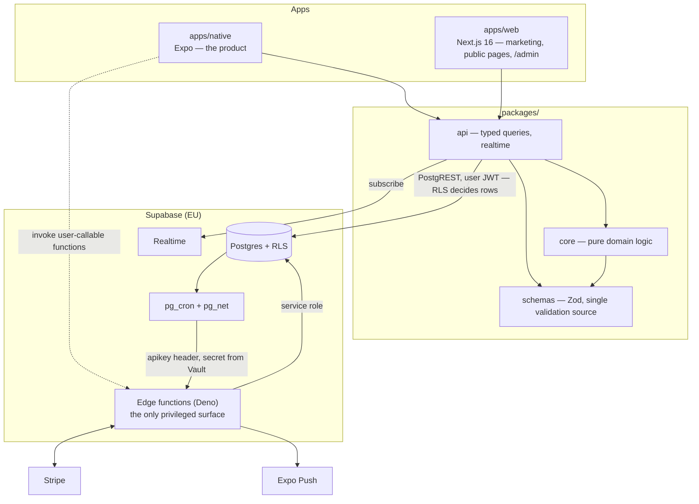

# Athanor — Architecture

**Status:** living document · describes the `dev` branch
**Reader:** you, a developer new to this repo. `README.md` tells you the rules and how to get running; this document tells you the shape of the system and the places where it behaves differently from what you would guess.
**Companion docs:** `docs/PRD.md` (what and why, by §) · `docs/DESIGN.md` (how it looks, by §) · `docs/RELEASE-RUNBOOK.md` (release ops) · `docs/PRODUCTION-READINESS.md` (what is parked, and P8's document map)

---

## 1. The system in one picture

Two apps sit on five shared packages. Everything talks to one hosted Supabase project (Postgres with row-level security, Auth, Realtime, Storage) plus a set of Deno edge functions — and the edge functions are the **only** privileged surface in the system. There is deliberately no middle API tier.

The dependency rule is strict and one-way: **apps → packages**, and inside packages `core` imports only `schemas`. `api` is plumbing with no business logic; `core` is business logic with no I/O. `i18n` and `config` (design tokens) are consumed by both apps.

## 2. How data moves

**Reads.** Screen → TanStack Query hook → an `@athanor/api` domain function → Zod parse → PostgREST with the user's JWT. **RLS decides which rows exist** — there is no server-side filtering layer to forget. Pagination is cursor-based everywhere (README rule 9); an `offset` is a bug even when it works, because it skips rows under concurrent inserts.

**Realtime.** Subscriber helpers in `@athanor/api` listen on `postgres_changes` and **invalidate query keys** rather than writing caches directly. Every subscriber returns its cleanup function, and callers unsubscribe on unmount — a subscription that outlives its screen leaks a channel.

**Privileged writes.** A client can never perform these; each has exactly one writer:

| Domain          | Sole writer                                                                                                            |
| --------------- | ---------------------------------------------------------------------------------------------------------------------- |
| Aura (score)    | `score-engine` — RLS denies all client writes; pgTAP asserts it                                                        |
| Money tables    | `stripe-webhook` — signature-verified, deduped                                                                         |
| Notifications   | `notification-fan-out` → rows → `push-dispatch` → Expo push                                                            |
| Fund lifecycle  | `screen-candidacy` · `declare-winner` · `announce-cycle` · `close-cycle` · `verify-plan-phase` · `release-fund-payout` |
| Moderation bans | `moderation-enforce` (applies the auth-level ban)                                                                      |
| Media hygiene   | `media-process` (strips EXIF/metadata on upload)                                                                       |

## 3. The edge-function contract

Every function declares exactly **one of three auth postures** in `supabase/config.toml`, and `_shared/config-invariants.test.ts` asserts the whole table — a new function cannot land with the wrong posture.

| Posture               | Gate                                                                                                                                                                                                                                                    |
| --------------------- | ------------------------------------------------------------------------------------------------------------------------------------------------------------------------------------------------------------------------------------------------------- |
| User-callable         | `verify_jwt = true` **and** `requireUser(req)` as the first statement. Two gates — the platform gate only proves a JWT is well-formed.                                                                                                                  |
| Internal service-role | `verify_jwt = false`, because an `sb_secret_…` key is not a JWT and the platform gate could only reject it. `requireServiceRole(req)` is therefore the **only** gate and must be the first statement — anything before it is reachable unauthenticated. |
| Webhook               | `verify_jwt = false`; authenticity is the Stripe signature plus dedupe on `stripe_webhook_events.event_id`.                                                                                                                                             |

Two conventions that look optional and are not:

- **API keys resolve only through `_shared/keys.ts`.** The platform injects `SUPABASE_PUBLISHABLE_KEYS` / `SUPABASE_SECRET_KEYS` as _name-keyed JSON_, not plain strings — a direct `Deno.env.get` returns something that only looks wrong at runtime.
- **`profile_id` always comes from `getUser()`, never from the request body.**

## 4. Database rules that bite

- **Migrations are append-only once applied.** Never edit one — write a new one (`supabase migration new <name>`). A wrong _comment_ in an applied migration can't be fixed either: corrections live in `supabase/MIGRATIONS-ERRATA.md`, and the pgTAP test is the source of truth. **Read the errata before trusting a migration's prose.**
- **A new table is unreachable by clients until its migration grants explicitly.** Default privileges were deliberately narrowed; the symptom of forgetting is a `42501` on a screen whose policies look correct. Every new table or view also owes a row in the grant-catalog pgTAP sweep.
- **Functions default the other way.** PostgreSQL grants EXECUTE broadly on new functions, so a trigger function must end its migration by revoking execute from `public`, `anon` and `authenticated`.
- **A RESTRICTIVE policy grants nothing.** When reading `pg_policies` to derive a table's intent, filter on `permissive = 'PERMISSIVE'` — the moderation net is restrictive and sits on most user-content tables.
- **There is no local Docker stack.** `supabase start` / `db reset` are CI's job; the `db` workflow job replays every migration from zero and runs pgTAP on each push with an open PR. Feedback arrives in minutes, not instantly — plan around it.

## 5. Environments

| Project           | Role                                                                                                                                                 |
| ----------------- | ---------------------------------------------------------------------------------------------------------------------------------------------------- |
| `athanor-staging` | The fake world. Same migrations and functions, Stripe test keys, seeded by `supabase/staging-seed/`. All development and QA happen here. Disposable. |
| `athanor`         | Production. Maintainer only.                                                                                                                         |

Migrations flow **staging first, production at release** — nothing in CI pushes to either. After a migration lands on staging, `pnpm gen:types` regenerates `packages/api/src/database.types.ts` from the staging project; never hand-edit it. ⚠️ `supabase/.temp/linked-project.json` is a single global that both `db push` and `functions deploy` obey — check what you are linked to before every push.

**How the database calls a function.** Triggers and `pg_cron` jobs reach edge functions through `pg_net`, resolving the URL and secret from **Vault** via `athanor.runtime_setting()` and presenting the key on the **`apikey`** header (never `Authorization` — the platform would parse a bearer token as a JWT). Every such caller **fails open to a no-op when its setting is missing**: unconfigured is silent, not broken, so verify that something _happened_, not that nothing errored.

## 6. The web app is a Cloudflare Worker

`apps/web` deploys to **Cloudflare Workers via OpenNext** — not Vercel, not a Node server. Consequences that bite:

- **There is no middleware file.** Not `middleware.ts`, not `proxy.ts` — the app has no middleware layer at all. Do not add one without deciding how it runs on Workers first.
- `.dev.vars` is Wrangler's secret file and is **separate from** `.env.local`; a var added to one is invisible to the other.
- Server-side authorization always uses `getUser()`, never `getSession()` — `getSession()` returns unverified cookie contents.
- A deploy does **not** clear the KV incremental cache; the previous build's entries strand under a dead prefix. `RELEASE-RUNBOOK §7.4` has the delete procedures.

The `/admin` moderation panel lives here too; its headless API is `packages/api/src/admin.ts` and stays callable without the panel.

## 7. The mobile app

Five icon-only tabs — Home, Community, Momenti, Costellazioni, Profilo — and **everything else is a modal route**. There is no global sheet or toast host; an overlay is a screen.

- **Boot gate.** The app reads `remote_config` at startup and can render blocking Force-Update or Maintenance screens without a store release. The decision is a pure function in `packages/core/src/boot/`; the server backstop returns HTTP 426 from every user-callable function to a client below the minimum version.
- **`EXPO_PUBLIC_*` is inlined by Metro at bundle time.** Every read must be a literal member expression — `process.env[name]` compiles, ships, and yields `undefined` at runtime with no error pointing at the cause. EAS cloud builds never read `.env`; a new public var must land in `.env.example` **and** as an EAS environment variable.
- **Payments never touch the client.** The app opens hosted Stripe Checkout URLs minted by edge functions, via `expo-web-browser`. `@stripe/stripe-react-native` is forbidden — a native module breaks App Store Expo Go, the only channel that currently reaches testers.
- Styling goes through the `src/tw` wrappers; plain React Native components do not accept `className` here. Tokens come from `@athanor/config` — no literal hex in app code.
- Use `pnpm exec expo …`, never `npx` — in this repo `npx expo` silently reports npm's own version and exits, so the command _looks_ like it ran.

## 8. `packages/core` is pure

No I/O, no `@supabase/*`, no `fetch` — and no inline `Date.now()` or `Math.random()`: clock and randomness are injected parameters, because the score engine is all boundaries (decay windows, caps per period) and a function that reads the clock internally cannot be tested at one. TDD is mandatory here (and only here), coverage gates sit at 90%, and mutation testing guards `core` and `schemas` with per-package thresholds. Score weights are named constants in one module — server-tunable, test-asserted (README rule 10).

## 9. Money

Stripe is the source of truth; our money tables are a **cache of its webhooks**, written only by `stripe-webhook` under the service role. Verify the signature, then dedupe, then work. And never fulfil on `checkout.session.completed` without checking `session.payment_status` — delayed methods (SEPA) settle days later, and a naive handler ships the goods before the money exists. Stripe keys are server-side only; the app never sees one.

## 10. Which document answers what

| Question                                  | Where                                                                                   |
| ----------------------------------------- | --------------------------------------------------------------------------------------- |
| What are the rules? How do I get running? | `README.md` — the condensed rulebook; it wins conflicts                                 |
| What does feature X do, and why?          | `docs/PRD.md`, cited by § from source comments                                          |
| How should it look?                       | `docs/DESIGN.md`, read before any visual decision                                       |
| How do we release?                        | `docs/RELEASE-RUNBOOK.md`                                                               |
| Why is Y parked / stubbed?                | `docs/PRODUCTION-READINESS.md` (P8 maps every document)                                 |
| What is the current work order?           | GitHub issue **#186** — waves and critical path, derived from the live dependency graph |
| A migration's comment looks wrong         | `supabase/MIGRATIONS-ERRATA.md` — it outranks the prose                                 |

Section numbers in PRD, DESIGN, RELEASE-RUNBOOK and PRODUCTION-READINESS are load-bearing — source comments cite them hundreds of times. Don't renumber.
